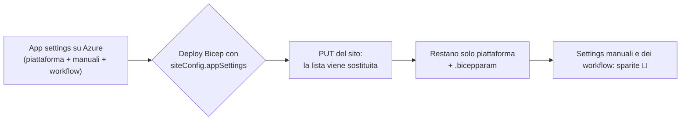

# Il redeploy che ti cancella le app settings

Lo conosci quel momento in cui fai un deploy "innocuo" da Bicep, giusto per aggiungere un parametro, e mezz'ora dopo qualcuno ti scrive che un flusso non parte più? Ecco. Questo post parla di quel momento, e di come smettere di viverlo. ☕

## Il problema

Ho un gruppo di Logic App (Standard) deployate da uno script PowerShell che lancia `New-AzResourceGroupDeployment` su un template Bicep. Tutto in modalità **incrementale**, quella di default, quella "tranquilla", quella che "tanto non tocca niente di quello che non dichiari".

La domanda che mi sono fatto prima dell'ennesimo deploy era semplice: *questo script sovrascrive le app settings che ci sono già sulla Logic App?*

Risposta breve: **sì. Tutte.**

## L'analisi

Il trucco sta in una distinzione che la documentazione non ti urla in faccia:

- La modalità incrementale **lascia stare le risorse che non sono nel template**.
- Ma una risorsa che **è** nel template viene **rimpiazzata** con quello che dichiari.

Il mio modulo dichiarava il sito così:

```bicep
resource logicApp 'Microsoft.Web/sites@2023-12-01' = {
  name: logicAppName
  // ...
  properties: {
    siteConfig: {
      appSettings: appSettings   // 👈 il colpevole
    }
  }
}
```

E `siteConfig.appSettings` non viene "unito": il PUT del sito sostituisce **l'intera lista**. Quindi dopo il deploy restano:

- le settings di piattaforma che il template calcola (`AzureWebJobsStorage`, `WEBSITE_CONTENTSHARE`, App Insights e compagnia);
- quelle scritte nel `.bicepparam`.

E **sparisce** tutto il resto:

- le settings aggiunte a mano dal portale ("dai, la metto al volo, poi la porto nel Bicep" 🙃);
- quelle create da altri deploy, per esempio quello dei workflow, con le connessioni e i parametri dei flussi.

Le app più a rischio erano proprio quelle che nel `.bicepparam` non avevano nessuna setting custom: al primo deploy si sarebbero ritrovate con le sole settings di piattaforma.



## La soluzione

Per le Function App avevo già risolto lo stesso problema con un piccolo modulo che fa la **union** tra le settings attuali e quelle desiderate. Ho applicato lo stesso schema alle Logic App.

Il modulo condiviso è minuscolo:

```bicep
// shared/modules/union-app-settings.bicep
param appSettings object
param currentAppSettings object
param siteName string

resource site 'Microsoft.Web/sites@2022-09-01' existing = {
  name: siteName
}

resource siteconfig 'Microsoft.Web/sites/config@2022-09-01' = {
  name: 'appsettings'
  parent: site
  properties: union(currentAppSettings, appSettings)
}
```

E nel modulo del sito:

1. **Ho tolto `appSettings` da `siteConfig`**, perché era quello il PUT che azzerava tutto.
2. **Ho aggiunto il modulo di overlay**, passandogli le settings attuali lette con `list()`:

```bicep
module appSettingsOverlay '../../shared/modules/union-app-settings.bicep' = {
  name: 'as-${logicAppName}'
  params: {
    siteName: logicApp.name
    appSettings: desiredAppSettings
    currentAppSettings: list(resourceId('Microsoft.Web/sites/config', logicApp.name, 'appsettings'), '2023-12-01').properties
  }
}
```

`desiredAppSettings` contiene le settings di piattaforma più quelle del `.bicepparam`, convertite da array a oggetto con `toObject()`. Il `list()` sul sito dà anche una dipendenza implicita, quindi l'overlay parte dopo che il sito esiste.

Il risultato è un `union(attuali, desiderate)`: se una chiave è nel template **vince il template**, se esiste solo su Azure **resta dov'è**.

> Prima di lanciarlo su tutte le app, provalo su una sola, e passa prima da `-WhatIf`. Sugli array di app settings il diff ARM non è il massimo della leggibilità, ma ti evita sorprese.
{: .prompt-tip }

## Gli effetti

- ✅ Le settings aggiunte fuori dal Bicep **sopravvivono** ai redeploy. Niente più flussi che smettono di partire "senza motivo".
- ✅ Function App e Logic App ora seguono **lo stesso schema**: un solo modulo condiviso, un solo comportamento da ricordare.
- ⚠️ La union è **solo additiva**. Se togli una chiave dal `.bicepparam`, il deploy non la cancella più dall'app: va rimossa a mano, per esempio con `az functionapp config appsettings delete`.
- ⚠️ Alla **prima creazione** di un'app nuova il sito nasce senza settings e le riceve subito dopo dall'overlay. C'è una piccola finestra in cui potrebbe non partire, poi si assesta.
- ⚠️ Non è una licenza per fare modifiche a mano. Una setting che vive solo sul portale è una setting che prima o poi qualcuno dimentica. La union ti protegge dal disastro, ma la casa giusta resta il Bicep.

## TL;DR

> In modalità incrementale, una risorsa dichiarata nel template viene rimpiazzata, e `siteConfig.appSettings` sostituisce **tutta** la lista. Toglila da `siteConfig`, leggi le settings attuali con `list()` e applica `union(attuali, desiderate)` su `Microsoft.Web/sites/config/appsettings`. I tuoi redeploy smetteranno di fare piazza pulita. 🧹
{: .prompt-tip }
