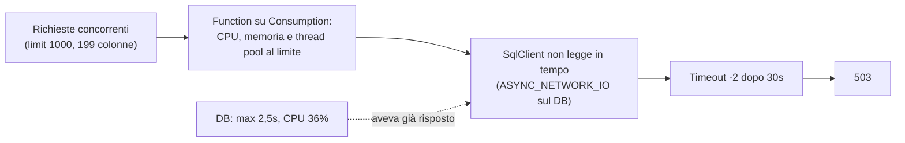

# Il database era lento ma i query plan erano perfetti

Stress test su un'API. A un certo punto arrivano i **503**, e nei log una frase che conosciamo tutti:

```
Execution Timeout Expired. The timeout period elapsed prior to completion
of the operation or the server is not responding. (Error Number: -2)
```

Il colpevole sembra ovvio: il database. Spoiler: il database era innocente. Ma per scoprirlo ci è voluto un piccolo giallo. 🔍

## Il problema

Una Azure Function HTTP espone un endpoint `/Products`. Dietro c'è EF Core che chiama una stored procedure su Azure SQL con `FromSqlRaw("EXEC ...")`. Sotto carico, le richieste iniziano a fallire con il timeout qui sopra, e la Function risponde 503.

Le prime ipotesi sul tavolo:

1. **"Troppe connessioni, facciamo il `DbContext` singleton."**
2. **"Il DB è saturo, ottimizziamo la stored procedure."**

Il problema è che i query plan erano **perfetti**. E un DB "lento" con piani perfetti è già un indizio.

## L'analisi

### Indizio n°1: l'errore non parla di connessioni

`Execution Timeout Expired` con Error Number **-2** è il **command timeout** di SqlClient (30 secondi di default): la connessione è stata ottenuta, ma la risposta non è arrivata in tempo. Se il pool fosse stato esaurito, l'errore sarebbe stato un altro: `Timeout expired... obtaining a connection from the pool... max pool size was reached`.

E il singleton? **No, grazie.** `DbContext` non è thread-safe: con richieste concorrenti ottieni `A second operation was started on this context...`. Le connessioni le riusa già il pool di ADO.NET, indipendentemente dal lifetime del context. E con entità keyless lette da stored procedure, EF non traccia nulla: creare un context per richiesta costa praticamente zero.

### Indizio n°2: le metriche del DB (quelle giuste)

Primo tentativo, la classica:

```sql
SELECT end_time, avg_cpu_percent, avg_data_io_percent, max_worker_percent
FROM sys.dm_db_resource_stats
ORDER BY end_time DESC;
```

Risultato: numeri quasi a zero. Sospetto. Perché:

- `sys.dm_db_resource_stats` conserva **solo l'ultima ora**, e il test era di due ore prima;
- restituisce i dati del **database corrente**, quindi va lanciata sul DB applicativo, non su `master`;
- e attenzione al **server**: con una geo-replica, guardare la replica che non riceve traffico è un ottimo modo per convincersi che va tutto bene. 🙃

Per andare indietro nel tempo c'è `sys.resource_stats`, **da `master`**, con campioni ogni 5 minuti e 14 giorni di storico (e niente colonna della memoria, quindi non chiederla):

```sql
-- connesso a master del server giusto
SELECT start_time, end_time,
       avg_cpu_percent, avg_data_io_percent, avg_log_write_percent,
       max_worker_percent, max_session_percent
FROM sys.resource_stats
WHERE database_name = '<nome-db>'
  AND start_time >= DATEADD(HOUR, -5, SYSUTCDATETIME())
ORDER BY start_time DESC;
```

Gli orari sono in **UTC**, ricordatelo prima di dire "ma alle tre non c'è niente".

Nella finestra del test:

| Metrica | Massimo | Tradotto |
|---|---|---|
| CPU | 36% | lontano dalla saturazione |
| Worker | 1,5% | nessuna coda di richieste |
| Sessioni | 0,11% | altro che "troppe connessioni" |
| Data IO | < 1% | i dati stavano in memoria |

### Indizio n°3: Query Store non mente

Sul DB applicativo, Query Store ha detto due cose decisive:

- **durata massima lato server: 2,5 secondi.** Nessuna esecuzione si è nemmeno avvicinata ai 30;
- tra le attese spiccava **`ASYNC_NETWORK_IO`**, con una media di circa 255 ms. In quello stato SQL Server ha già i risultati pronti e **aspetta che il client li legga**.

La prova del nove è cercare le esecuzioni interrotte dal client:

```sql
SELECT rs.execution_type_desc,
       SUM(rs.count_executions)  AS executions,
       MAX(rs.max_duration)/1000 AS max_duration_ms
FROM sys.query_store_runtime_stats rs
JOIN sys.query_store_runtime_stats_interval i
  ON i.runtime_stats_interval_id = rs.runtime_stats_interval_id
WHERE i.start_time >= DATEADD(HOUR, -5, SYSUTCDATETIME())
GROUP BY rs.execution_type_desc;
```

Se la Function avesse interrotto una query ancora in corso, avremmo visto righe `Aborted` con durata vicina ai 30 secondi. **Zero.** Il server non ha mai visto una query lunga.

### Il colpevole: la Function

Quindi i 30 secondi si perdevano **tutti lato Function**. E guardando il codice i conti tornavano:

- la stored procedure restituiva sempre **199 colonne**, ma il DTO di risposta di default ne usava **78**: circa il 60% dei dati veniva letto, trasferito, materializzato e poi buttato;
- `limit` aveva default **1000** e **nessun tetto massimo**;
- stima a spanne: qualche MB di JSON per risposta, il doppio in memoria (stringhe UTF-16, più entità, DTO e buffer di serializzazione che convivono);
- il tutto su un piano **Consumption**: circa 1 vCPU e 1,5 GB per istanza.

Bastano qualche decina di richieste concorrenti e l'istanza va in crisi di GC e **thread pool**. Le continuazioni async di SqlClient non vengono eseguite in tempo, scatta il timeout anche se il DB ha già risposto, e la Function restituisce 503.



## La soluzione

Ottimizzare la stored procedure, a quel punto, serviva a poco: rispondeva già in meno di 2,5 secondi. Le leve vere erano **meno dati per richiesta** o **più risorse alla Function**. In ordine, dalla più rapida alla più strutturale:

1. **Un tetto massimo su `limit`.** Una riga di codice, un `BadRequest` oltre la soglia. Non rompe chi usa il default e blocca le richieste anomale.
2. **Una variante "slim" della stored procedure**, con solo le colonne che il DTO usa davvero. Circa il 60% di dati in meno per le chiamate che usano la risposta di default, senza cambiare il contratto dell'API.
3. **Un piano dedicato** (Elastic Premium o App Service) se quel carico è reale: più CPU e memoria per istanza, istanze già pronte, niente cold start.

> Prima di ottimizzare il database, chiedigli se è davvero lui. `sys.resource_stats` e Query Store rispondono in cinque minuti, un refactoring sbagliato costa settimane.
{: .prompt-tip }

## Gli effetti

- ✅ **Evitato un refactoring dannoso**: il `DbContext` singleton avrebbe rotto il servizio sotto carico, senza risolvere niente.
- ✅ **Evitato un tuning inutile**: settimane passate a limare una stored procedure che rispondeva già in 2,5 secondi.
- ✅ **Il problema è finalmente nel posto giusto**: dimensione delle risposte e piano di hosting della Function, con un ordine chiaro su cosa fare prima.
- ⚠️ Lezione per la prossima volta: con un timeout **-2**, guarda **entrambi i lati del filo**. "Il DB non ha risposto in tempo" e "il client non ha letto in tempo" producono lo stesso identico errore.

## TL;DR

> `Execution Timeout Expired (-2)` non vuol dire per forza "DB lento". Controlla `sys.resource_stats` (da `master`, in UTC, sul server giusto) e Query Store: se la durata massima lato server è bassa, non ci sono esecuzioni `Aborted` e vedi `ASYNC_NETWORK_IO`, il collo di bottiglia è il client. Nel mio caso: troppi dati per richiesta su una Function troppo piccola. 🐢➡️🐇
{: .prompt-tip }
